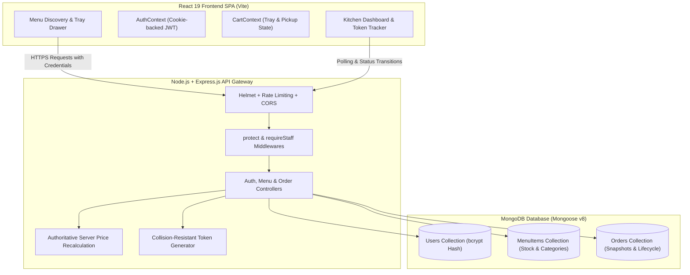
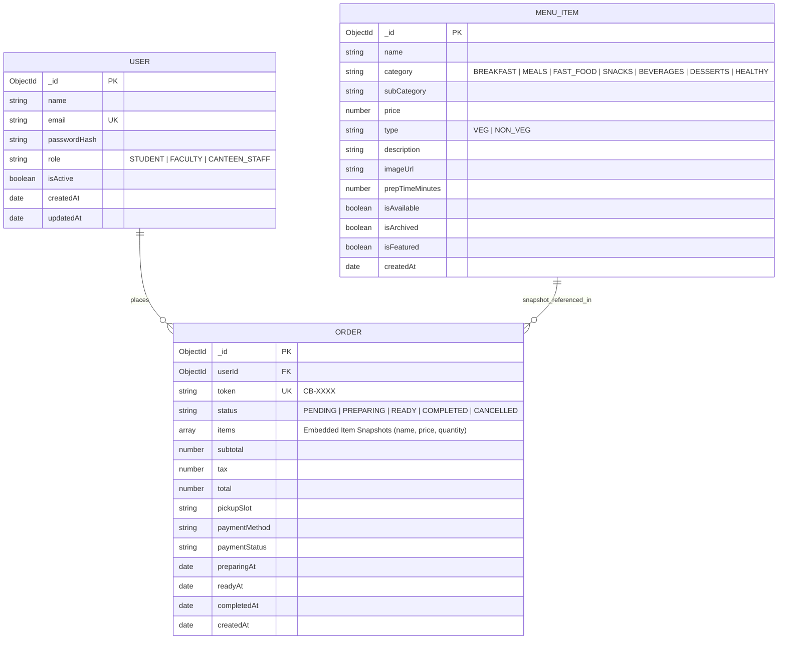
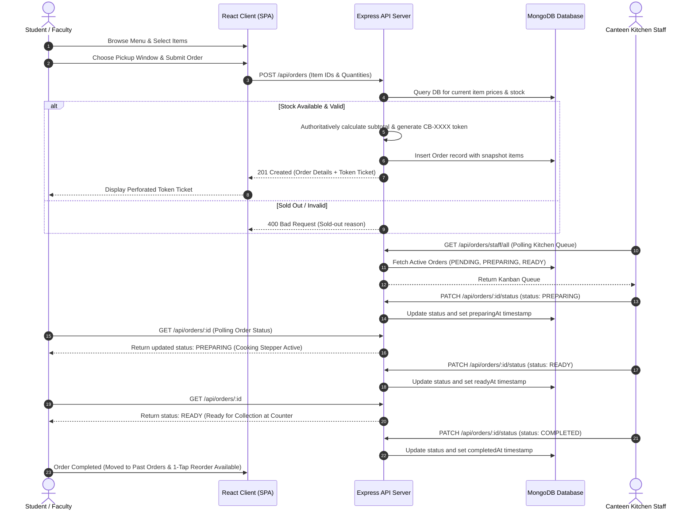

# CampusBite 🍱 — Smart Campus Canteen Pre-Ordering Platform

> **Modern Full-Stack MERN Application** (MongoDB, Express.js, React 19 + Vite, Node.js) engineered for high-speed campus food pre-ordering, scheduled pickup windows, collision-resistant digital token tickets, and real-time kitchen operations.

[](https://github.com/SreeshM18/Campusbite/actions/workflows/ci.yml)
[](https://github.com/SreeshM18/Campusbite/actions/workflows/codeql.yml)
[](./LICENSE)
[](https://nodejs.org/)
[](https://react.dev/)
[](https://www.mongodb.com/)

---

## 👥 Project Team
- **Sreesh M**
- **Sreesanth Vishak**
- **Sanjay**

---

## 🚀 The Problem & The Solution

### The Campus Problem
During 15-minute lecture breaks and 45-minute lunch periods, college food courts and canteens face severe congestion:
- Students spend 20–30 minutes waiting in chaotic physical lines just to order and pay.
- Canteen kitchen staff struggle with verbal paper chits and untracked queue bottlenecks.
- Students frequently experience sold-out disappointment after waiting in line.

### The CampusBite Solution
**CampusBite** connects students, faculty, and canteen staff in a unified, synchronized web ecosystem:
1. **Pre-Order Anywhere:** Students browse live dietary-filtered menus from lecture halls or dorms.
2. **Scheduled Pickups:** Orders can be scheduled for immediate preparation or timed for future breaks (15m, 30m, 45m, 1h).
3. **Digital Token Ticket (`CB-XXXX`):** A perforated high-contrast digital token is generated upon checkout for express collection at Counter #3.
4. **Kitchen Operations Dashboard (KDS):** Kitchen staff track orders in a real-time Kanban queue (`PENDING` → `PREPARING` → `READY` → `COMPLETED`), with instant sold-out and price controls.

---

## 🌟 Key Features

### 🎓 Customer Experience (Students & Faculty)
- **Menu Discovery:** 7 curated categories (`BREAKFAST`, `MEALS`, `FAST_FOOD`, `SNACKS`, `BEVERAGES`, `DESSERTS`, `HEALTHY`) with real-time text search and instant dietary toggles (`Pure Veg` / `Non-Veg`).
- **Interactive Food Tray:** Slide-over drawer and dedicated `/cart` with quantity steppers, itemized prices, and subtotal calculation.
- **Server Price Validation:** Client cannot manipulate order totals; prices are pulled authoritatively from MongoDB at checkout.
- **Scheduled Pickup Windows:** Choose immediate prep or scheduled break intervals (15m, 30m, 45m, 1h).
- **Sandbox UPI Demo Payment:** Dynamic QR code matching order totals with honest educational demo disclaimers.
- **Perforated Token Badge (`CB-XXXX`):** High-visibility monospace token for zero-friction counter scanning.
- **Live Order Tracker:** 4-step real-time progress timeline with 10-second smart auto-polling.
- **1-Tap Reorder:** Re-order past meals with automatic catalog price and stock revalidation.
- **Profile & Account Management:** Edit display name and securely change password with current password verification.

### 🍳 Canteen Staff Operations
- **Real-Time Kitchen Kanban Queue:** Color-coded columns for incoming (`PENDING`), cooking (`PREPARING`), and packed (`READY`) orders.
- **1-Click Status Progression:** Touch-optimized buttons (≥44px) to advance orders with automatic timestamping.
- **Token Search:** Fast instant lookup by token number (`CB-XXXX`) in the kitchen queue.
- **Live Menu Administration:** Add new dishes, edit prices/descriptions, and toggle instant **Sold Out / Available** stock under 50ms.
- **Non-Destructive Archiving:** Archive seasonal dishes (`isArchived: true`) without corrupting historical customer receipts.

---

## 🛠️ Technology Stack

| Layer | Technologies |
| :--- | :--- |
| **Frontend** | React 19, Vite 6, React Router v7, Lucide Icons, Canvas Confetti, Custom CSS Design Tokens |
| **Backend** | Node.js (v20+), Express.js (v4), Cookie Parser, CORS, Helmet, Express Rate Limit |
| **Database** | MongoDB (v8 / Atlas Cloud) + Mongoose ODM (v8) |
| **Authentication** | JSON Web Tokens (JWT) stored in HTTP-Only secure cookies, bcryptjs password hashing (10 rounds) |
| **CI/CD & Security** | GitHub Actions CI Pipeline, CodeQL Security Analysis, Dependabot |

---

## 🏗️ System Architecture



---

## 🗄️ Database Entity-Relationship Diagram



---

## 🔄 User & Order Lifecycle Flow



---

## 📂 Project Structure

```text
campusbite/
├── client/                     # React 19 + Vite Frontend SPA
│   ├── public/                 # Static assets, images, _redirects
│   ├── src/
│   │   ├── components/         # CartDrawer, PickupScheduler, FoodCard, TokenBadge, Timeline
│   │   ├── context/            # AuthContext (HTTP-Only cookies) & CartContext
│   │   ├── pages/              # Menu, Login, Register, Checkout, Tracker, Staff, Profile
│   │   ├── services/api.js     # Centralized REST API client with credentials
│   │   └── styles/             # Human-crafted CSS Design Tokens & A11y rules
│   ├── .env.example
│   ├── vercel.json             # SPA routing rewrite configuration
│   └── package.json
│
├── server/                     # Express.js REST API Backend
│   ├── src/
│   │   ├── config/db.js        # MongoDB Atlas / Mongoose connection with fallback
│   │   ├── controllers/        # authController, menuController, orderController
│   │   ├── middleware/         # protect, requireStaff, requireRole, errorHandler
│   │   ├── models/             # User, MenuItem, Order schemas
│   │   ├── routes/             # authRoutes, menuRoutes, orderRoutes
│   │   ├── seeds/              # 114-item campus menu seed data
│   │   ├── app.js              # Express app, Helmet, CORS, Rate limiting
│   │   └── server.js           # Server listener
│   ├── test_phase11.js         # Automated authentication & security test suite
│   ├── test_phase12_e2e.js     # Automated full-system E2E test suite
│   ├── .env.example
│   └── package.json
│
├── docs/                       # Comprehensive Architecture & Engineering Documentation
│   ├── ARCHITECTURE.md         # System boundaries & data flows
│   ├── API.md                  # REST endpoint specifications & schemas
│   ├── AUTH.md                 # Identity flows, role models & session restore
│   ├── SECURITY.md             # RBAC, Helmet headers, rate limiting, and IDOR defense
│   ├── DESIGN_SYSTEM.md        # Semantic color tokens, typography scales, components
│   ├── UX_ARCHITECTURE.md      # Customer ordering & post-order lifecycle UX
│   ├── MENU_MANAGEMENT.md      # Staff menu operations & stock controls
│   ├── QA_MASTER_PLAN.md       # Comprehensive QA execution plan & test verdict matrix
│   ├── QA_REPORT.md            # Full-system QA execution report
│   ├── BUG_LOG.md              # Categorized defect log & root cause analyses
│   ├── DEMO_SCRIPT.md          # 5-minute presentation viva demo script
│   └── DEPLOYMENT.md           # Step-by-step Vercel, Render & MongoDB Atlas deployment
│
├── .github/
│   ├── workflows/
│   │   ├── ci.yml              # Automated GitHub Actions CI workflow
│   │   └── codeql.yml          # Automated CodeQL security analysis
│   ├── ISSUE_TEMPLATE/         # Bug report and feature request templates
│   ├── PULL_REQUEST_TEMPLATE.md
│   ├── dependabot.yml          # Automated npm dependency scanning
│   └── CODEOWNERS
├── .env.example
├── .gitignore
├── CHANGELOG.md
├── CONTRIBUTING.md
├── SECURITY.md
├── LICENSE
├── render.yaml                 # Infrastructure as code for Render deployment
└── package.json                # Root monorepo workspace runner
```

---

## 🔑 Demo Accounts

The database auto-seeds test accounts for rapid evaluation:

| Role | Email | Password | Access Scope |
| :--- | :--- | :--- | :--- |
| **Kitchen Staff** | `staff@campusbite.edu` | `staff123` | Kitchen Queue (`/staff/orders`) & Menu Management (`/staff/menu`) |
| **Student** | `student@campusbite.edu` | `student123` | Menu, Tray, Checkout, Token Tracking, Profile |
| **Faculty** | `faculty@campusbite.edu` | `faculty123` | Priority Menu, Tray, Checkout, Token Tracking |

*(The `/login` screen includes 1-click demo login buttons for instant evaluation).*

---

## ⚡ Quickstart & Installation

### Prerequisites
- **Node.js**: v20.0.0 or higher
- **npm**: v10.0.0 or higher
- **MongoDB**: Local MongoDB instance or free MongoDB Atlas URI

### 1. Clone & Install Dependencies
```bash
git clone https://github.com/SreeshM18/Campusbite.git
cd Campusbite

# Install root, backend, and frontend dependencies in one command
npm run install:all
```

### 2. Configure Environment Variables
Create a `server/.env` file:
```env
PORT=5000
NODE_ENV=development
MONGODB_URI=mongodb://127.0.0.1:27017/campusbite_db
JWT_SECRET=campusbite_super_secure_jwt_secret_key_2026_production
CLIENT_URL=http://localhost:5173
```

### 3. Run the Full Application
```bash
# Starts Express backend (Port 5000) and Vite frontend (Port 5173) concurrently
npm run dev
```

Visit **http://localhost:5173** in your browser.

### 4. Run Automated Test Suites
```bash
# Run monorepo test suite (Phase 11 Security & Phase 12 E2E QA)
npm test

# Build frontend production bundle
npm run build
```

---

## 🛡️ Security & Hardening Highlights
- **No Plaintext Passwords:** All passwords hashed with bcrypt (salt rounds = 10). `passwordHash` is configured with `select: false` at schema level.
- **HTTP-Only Cookies:** JWT tokens stored exclusively in `httpOnly: true`, `sameSite: 'lax'`/`'strict'`, `secure: true` cookies (immune to client-side XSS exfiltration).
- **Server Price Authority:** Subtotals calculated authoritatively from MongoDB database records; client price tampering is nullified.
- **Public Staff Registration Blocked:** Public registration accepts only `STUDENT` and `FACULTY`. Staff accounts are provisioned internally.
- **Mass-Assignment Defense:** User profile updates strictly whitelist `name`, protecting `role`, `email`, `isActive`, and `passwordHash`.
- **IDOR Protection:** Students can only inspect and cancel their own orders (`403 Forbidden` on unauthorized access).
- **Helmet Security Headers:** `X-Content-Type-Options: nosniff`, `X-Frame-Options: SAMEORIGIN`, and XSS filters.
- **Rate Limiting:** `express-rate-limit` protects sensitive authentication endpoints (60 req/15min).

---

## 📜 Documentation Reference
- [QA_REPORT.md](./docs/QA_REPORT.md) — Full-system quality assurance, test suites, and audit results.
- [DEMO_SCRIPT.md](./docs/DEMO_SCRIPT.md) — 5-minute presentation & evaluation demo script.
- [DEPLOYMENT.md](./docs/DEPLOYMENT.md) — Step-by-step Vercel, Render & MongoDB Atlas guide.
- [SECURITY.md](./SECURITY.md) — Authentication, RBAC, Helmet headers, and security hardening.
- [AUTH.md](./docs/AUTH.md) — Identity flows, role models, password changes, and session restoration.
- [UX_ARCHITECTURE.md](./docs/UX_ARCHITECTURE.md) — Human-crafted customer ordering, tracking, and profile UX.
- [DESIGN_SYSTEM.md](./docs/DESIGN_SYSTEM.md) — Semantic color tokens, typography scales, and component specs.
- [API.md](./API.md) — REST endpoint specifications and request/response contracts.
- [BUG_LOG.md](./docs/BUG_LOG.md) — Categorized defect log, root cause analyses, and verification status.

---

## 🚀 Known Limitations & Future Enhancements

### Known Limitations
1. **Demo Payment Gateway:** Payment simulation calculates dynamic QR codes and confirms payment in-memory without live banking webhooks.
2. **Push Notifications:** Order readiness updates rely on 10-second smart client polling rather than persistent WebSockets.

### Future Roadmap
- **Real Gateway Integration:** Razorpay / Stripe webhooks with HMAC-SHA256 signature verification.
- **Real-Time Sockets:** Socket.IO / WebSockets for sub-second kitchen token updates.
- **Multi-Counter Support:** Dynamic routing across separate food court counters (e.g. Juice Bar, South Indian, Chinese Wok).
- **Push Notifications:** WebPush browser notifications when token status reaches `READY`.

---

## 📄 License
This project is open-source and available under the [MIT License](./LICENSE).
