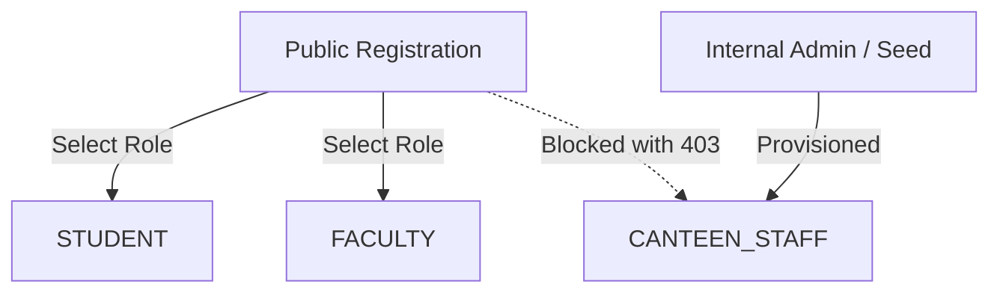

# CampusBite — Identity & Authentication System

**Version:** 2.0 (MERN Architecture)  
**Document:** Authentication & Profile Specification (`docs/AUTH.md`)  

---

## 1. Identity System Overview
CampusBite implements cookie-based JSON Web Token (JWT) authentication designed specifically for campus dining pre-ordering.

### Key Principles
- **No Token in Web Storage:** `localStorage` and `sessionStorage` are never used for tokens, shielding against script-based token theft.
- **Silent Session Restoration:** On app startup, React queries `GET /api/auth/me` with credential cookies.
- **Graceful Session Expiry:** Expired tokens return `401 Unauthorized`, prompting the frontend to preserve the customer's food tray while redirecting to `/login` with an automatic return path.

---

## 2. Role Model



| Role | Landing Route | Access Scope |
| :--- | :--- | :--- |
| `STUDENT` | `/menu` | Customer ordering, tracking, reordering, profile |
| `FACULTY` | `/menu` | Priority customer ordering, tracking, profile |
| `CANTEEN_STAFF` | `/staff/orders` | Real-time kitchen queue, token lookup, menu management |

---

## 3. Endpoints & Request Lifecycles

### 3.1 Public Registration: `POST /api/auth/register`
- **Request Body:**
  ```json
  {
    "name": "Alex Rivera",
    "email": "alex.rivera@campusbite.edu",
    "password": "Password123!",
    "role": "STUDENT"
  }
  ```
- **Validation Rules:**
  - `name`: String, minimum 2 characters, trimmed.
  - `email`: Valid RFC 5322 format, lowercase normalized, unique index.
  - `password`: Minimum 8 characters.
  - `role`: Must be `STUDENT` or `FACULTY` (`CANTEEN_STAFF` rejected with 403).
- **Response (201 Created):** Sets `token` HTTP-only cookie and returns safe user object without `passwordHash`.

### 3.2 Login: `POST /api/auth/login`
- **Request Body:**
  ```json
  {
    "email": "alex.rivera@campusbite.edu",
    "password": "Password123!"
  }
  ```
- **Security Logic:**
  - Normalizes email before database query.
  - Fetches user with `.select('+passwordHash')`.
  - Verifies `user.isActive === true`.
  - Verifies bcrypt candidate password match.
  - Updates `lastLoginAt` timestamp.
  - Issues 7-day JWT cookie with `httpOnly: true`.

### 3.3 Session Restoration: `GET /api/auth/me`
- Executed on frontend initialization (`AuthContext`).
- Extracts JWT from cookie or fallback Bearer header.
- Returns safe user entity `{ id, name, email, role, createdAt }`.

### 3.4 Profile Update: `PATCH /api/auth/profile`
- Modifies user display name.
- Role, email, and password hash are immutable through this endpoint.

### 3.5 Password Change: `PATCH /api/auth/password`
- Requires `currentPassword` verification via `bcrypt.compare`.
- Enforces minimum 8 characters for `newPassword`.
- Re-hashes and saves updated password.

### 3.6 Logout: `POST /api/auth/logout`
- Invalids cookie by setting `expires: new Date(0)`.
- React state resets user to `null`.
