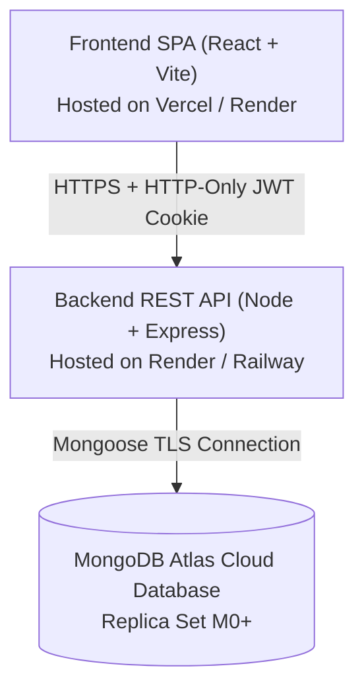

# CampusBite — Production Deployment Guide (`docs/DEPLOYMENT.md`)

**Version:** 1.0.0 (Production Release)  
**Stack:** React 19 (Vite) + Express.js + MongoDB Atlas  

---

## 1. Production Architecture Overview



---

## 2. Step 1: MongoDB Atlas Setup

1. **Create Free M0 Cluster:**
   - Log in to [MongoDB Atlas](https://www.mongodb.com/cloud/atlas).
   - Create a project named `CampusBite` and deploy a shared M0 cluster in your preferred region.
2. **Create Database User:**
   - Navigate to **Database Access** → **Add New Database User**.
   - Authentication Method: **Password**.
   - Set username `campusbite_admin` and generate a strong password.
   - Database User Privileges: `Read and write to any database`.
3. **Network Access (IP Whitelist):**
   - Navigate to **Network Access** → **Add IP Address**.
   - Select **Allow Access From Anywhere** (`0.0.0.0/0`) to allow connections from cloud hosts like Render/Vercel.
4. **Get Connection String:**
   - Navigate to **Database** → **Connect** → **Drivers** (Node.js).
   - Copy the SRV URI:
     ```env
     mongodb+srv://campusbite_admin:<PASSWORD>@cluster0.abcde.mongodb.net/campusbite?retryWrites=true&w=majority
     ```

---

## 3. Step 2: Backend API Deployment (Render / Railway)

1. **Create Web Service:**
   - Connect your GitHub repository to [Render](https://render.com).
   - **Root Directory:** `server`
   - **Environment:** `Node`
   - **Build Command:** `npm install`
   - **Start Command:** `npm start`
2. **Set Environment Variables on Render:**
   | Variable | Value | Description |
   | :--- | :--- | :--- |
   | `NODE_ENV` | `production` | Enables production security & optimizations |
   | `PORT` | `5000` | Render port assignment (or leave default) |
   | `MONGODB_URI` | `mongodb+srv://...` | MongoDB Atlas SRV URI from Step 1 |
   | `JWT_SECRET` | `<GENERATE_RANDOM_64_CHAR_KEY>` | Strong random secret for token signing |
   | `CLIENT_URL` | `https://campusbite.vercel.app` | Production URL of the frontend |
3. **Verify API Health:**
   - Once deployed, visit `https://campusbite-api.onrender.com/api/health`.
   - Expected response:
     ```json
     {
       "status": "online",
       "timestamp": "2026-10-04T12:00:00.000Z",
       "service": "CampusBite MERN REST API"
     }
     ```

---

## 4. Step 3: Frontend Deployment (Vercel)

1. **Import Project into Vercel:**
   - Connect your GitHub repository on [Vercel](https://vercel.com).
   - **Root Directory:** `client`
   - **Framework Preset:** `Vite`
   - **Build Command:** `npm run build`
   - **Output Directory:** `dist`
2. **Set Environment Variables on Vercel:**
   | Variable | Value | Description |
   | :--- | :--- | :--- |
   | `VITE_API_URL` | `https://campusbite-api.onrender.com/api` | Base URL of deployed backend |
3. **Deploy:**
   - Click **Deploy**. Vercel will automatically configure the `vercel.json` SPA rewrite rules.

---

## 5. Step 4: Verification & Live Cross-Device Test

1. **Test Registration & Login:**
   - Open deployed frontend (`https://campusbite.vercel.app`).
   - Register a fresh account or log in with demo accounts.
   - Verify that HTTP-only `token` cookie is stored with `Secure: true`.
2. **Test End-to-End Ordering:**
   - Add items to tray → Schedule pickup → Place order → Verify `CB-XXXX` token generated.
3. **Test Kitchen Dashboard:**
   - Open `/staff/orders` in another browser/device.
   - Advance status from `PENDING` to `PREPARING` → `READY` → `COMPLETED`.
   - Verify status updates dynamically on student device.
